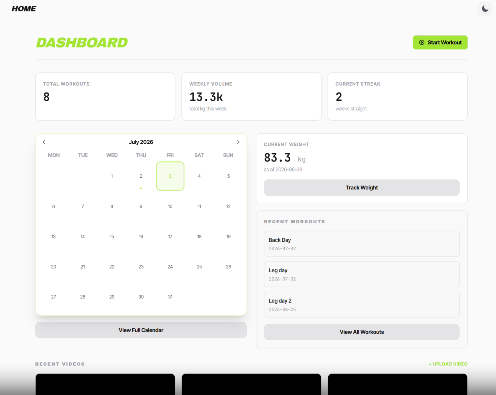
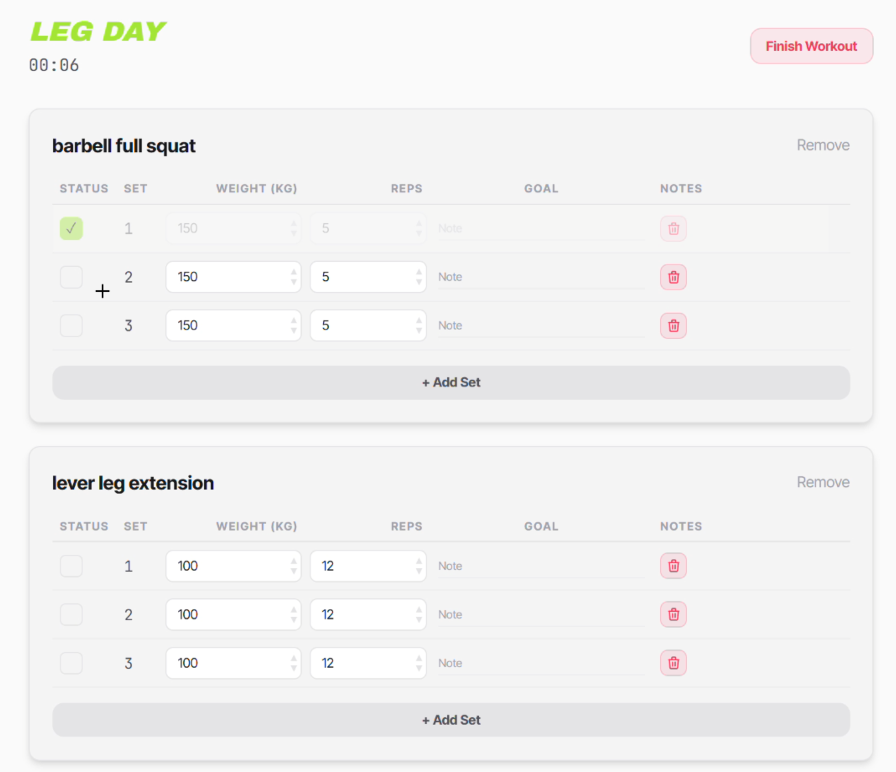
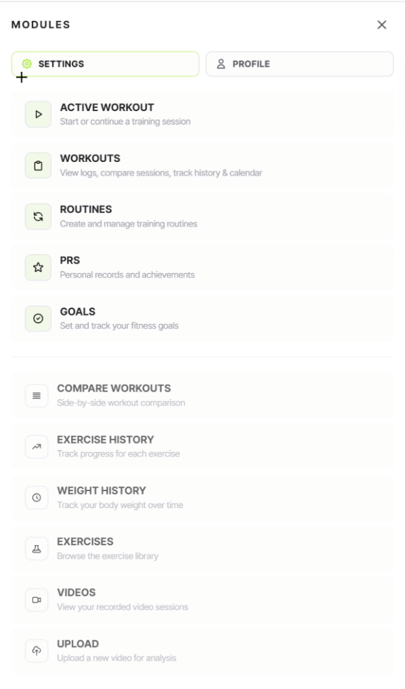
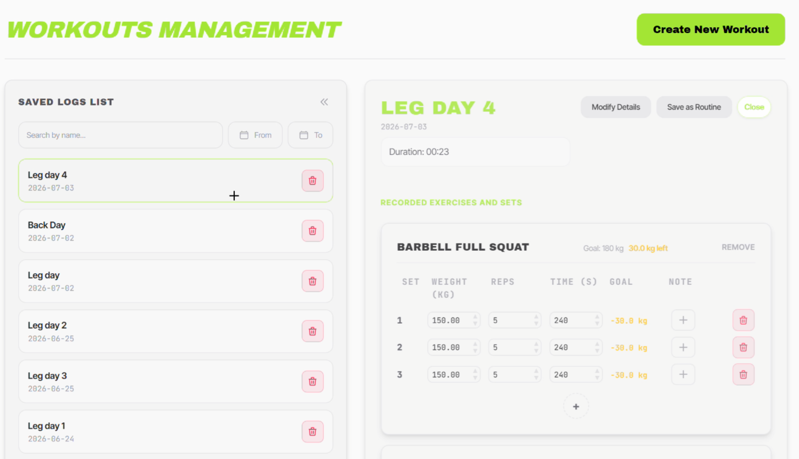
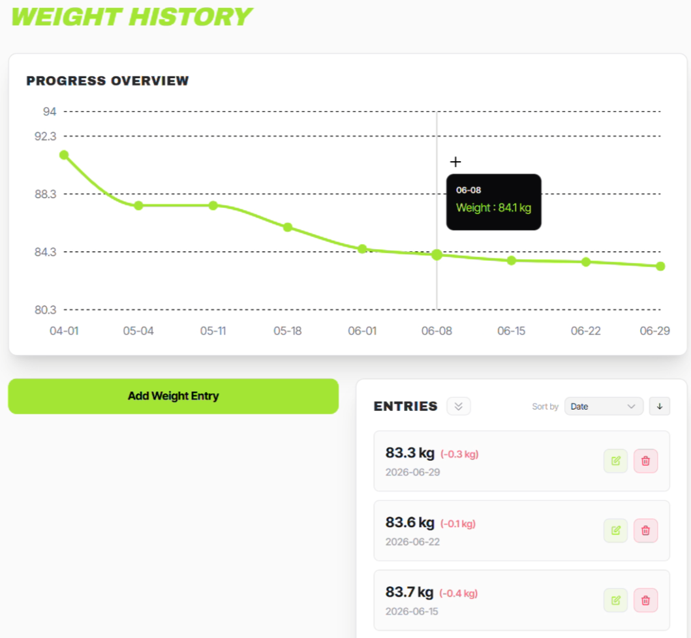
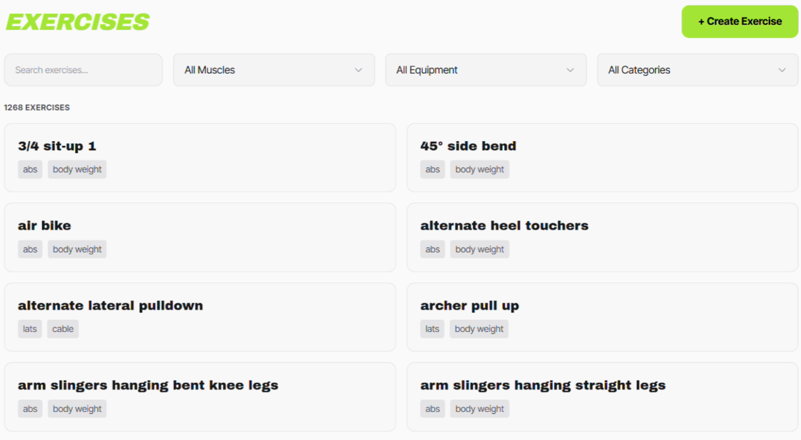

# Gym Tracker

**A full-stack workout tracking app with computer vision form analysis.**

---

## 📸 Features / Ezaugarriak

| Dashboard | Active Workout | Video Analysis |
| :---: | :---: | :---: |
|  |  |  |
| **Workout History** | **Weight Tracking** | **Exercise Library** |
|  |  |  |

---

## Technology Requirements / Teknologia-beharrak

| Category / Kategoria | Technologies / Teknologiak |
|---|---|
| Backend (API) | **Express.js** (Node.js) |
| Frontend | **React**, **TypeScript**, **Tailwind CSS**, **React Router**, **Recharts** |
| Computer Vision / Ikusmen konputazionala | **Python**, **OpenCV**, **MediaPipe**, **NumPy**, **SciPy**, **Roboflow** |
| Database / Datu-basea | **PostgreSQL** |
| Authentication / Autentifikazioa | **JWT**, **bcrypt** |
| File Uploads / Fitxategi kargak | **Multer** |
| HTTP Client / HTTP bezeroa | **Fetch API** |
| Testing | **Jest**, **Supertest**, **React Testing Library** |
| Video Processing / Bideo prozesamendua | **FFmpeg** |
| Version Control / Bertsio-kontrola | **Git**, **GitHub** |

### Prerequisites / Aurretiko beharrak

- **Node.js** 18+ (LTS recommended)
- **PostgreSQL** 15+
- **Python** 3.10 – 3.12
- **FFmpeg**
- **npm** or **yarn**

---

## Description / Deskribapena

**EN** — Gym Tracker analyzes exercise videos using computer vision to evaluate barbell path, velocity, and lifting technique. Users can log their workouts, upload videos, track personal records, set goals, and view visual analytics of their performance. The system uses an Express.js (Node.js) + React + PostgreSQL architecture, with a barbell tracking module implemented in Python using OpenCV and MediaPipe.

**EU** — Aplikazioak ariketen bideoak aztertzen ditu ikusmen konputazionalaren bidez, barraren ibilbidea, abiadura eta teknika ebaluatzeko. Erabiltzaileek beren entrenamenduak gorde, bideoak igo, marka pertsonalak jarraitu, helburuak ezarri eta errendimenduaren analisi bisualak ikus ditzakete. Sistema honek Express.js (Node.js) + React + PostgreSQL arkitektura erabiltzen du, eta barbell tracking modulua Python-ez inplementatzen da OpenCV eta MediaPipe erabiliz.

---

## Features / Ezaugarriak

| English | Euskera |
|---------|---------|
| **Dashboard** — View total workouts, weekly volume, streaks, and recent activity at a glance | **Panela** — Ikusi entrenamendu kopurua, asteko bolumena, jarraipenak eta azken jarduera begirada batean |
| **Workout Logging** — Create, edit, and track workouts with sets, reps, weight, RPE, and rest timers | **Entrenamenduen erregistroa** — Sortu, editatu eta jarraitu entrenamenduak serie, errepikapen, pisu, RPE eta atseden-denborarekin |
| **Routines** — Build reusable workout templates and schedule them on specific dates | **Errutinak** — Sortu berrerabil daitezkeen entrenamendu txantiloiak eta egutegian kokatu |
| **Personal Records (PRs)** — Track your best lifts per exercise with history | **Marka pertsonalak (PR)** — Jarraitu zure altxaldi onenak ariketa bakoitzeko historian |
| **Goals** — Set target weight and rep goals with deadline tracking | **Helburuak** — Ezarri pisu eta errepikapen helburuak epeekin |
| **Video Analysis** — Upload workout videos for pose estimation and barbell tracking | **Bideo analisia** — Igo entrenamendu bideoak postura kalkulatzeko eta barraren ibilbidea aztertzeko |
| **Pose Estimation** — MediaPipe-based full-body pose tracking with rep counting | **Postura kalkulua** — MediaPipe bidezko gorputz osoaren postura jarraipena errepikapen kontagailuarekin |
| **Barbell Tracking** — Real-time barbell path visualization with velocity curves | **Barraren ibilbidea** — Barraren ibilbidearen bistaratzea denbora errealean abiadura kurbekin |
| **Compare Workouts** — Side-by-side volume and exercise comparison | **Entrenamenduen konparazioa** — Bolumen eta ariketen konparazioa alboko ikuspegian |
| **Exercise History** — Per-exercise progress charts over time | **Ariketa historiala** — Ariketa bakoitzaren aurrerapenaren grafikoak denboran zehar |
| **Weight Tracking** — Log body weight and view trends | **Pisuaren jarraipena** — Gorputz pisua erregistratu eta joerak ikusi |
| **Workout Calendar** — Visual calendar of all your logged sessions | **Entrenamendu egutegia** — Saio guztien egutegi bisuala |
| **Dark / Light Theme** — Toggle between dark and light mode | **Gai iluna / argia** — Aldatu gai ilun eta argiaren artean |
| **Customizable Settings** — Show/hide RPE, 1RM estimates, and rest timers | **Ezarpen pertsonalizagarriak** — Erakutsi/eskutatu RPE, 1RM estimazioak eta atseden-denbora |

---

## Quick Start / Hasiera azkarra

### 1. Clone the repository / Klonatu biltegia

```bash
git clone https://github.com/AdeiTamayo/GrAl_Tamayo_Adei
cd GrAl_Tamayo_Adei/gym-tracker-app
```

### 2. Configure environment / Konfiguratu ingurunea

Create a `.env` file in the repository root (parent of `gym-tracker-app/`):

```env
PORT=8000
DB_HOST=localhost
DB_PORT=5432
DB_NAME=gym_tracker
DB_USER=postgres
DB_PASSWORD=your_password
JWT_SECRET=your_long_random_secret
```

### 3. Install & run backend / Instalatu eta exekutatu backend-a

```bash
cd backend
npm install
python -m pip install -r requirements.txt
node migrate.js
npm start
```

### 4. Install & run frontend / Instalatu eta exekutatu frontend-a

```bash
cd frontend
npm install
npm start
```

The API runs on `http://localhost:8000` and the frontend on `http://localhost:3000`.

---

## Project Structure / Proiektuaren egitura

```
gym-tracker-app/
├── backend/
│   ├── __tests__/          # Backend test suite
│   ├── config/             # Database connection
│   ├── controllers/        # Route handlers
│   ├── middleware/         # Auth & file upload
│   ├── migrations/         # SQL schema migrations
│   ├── models/            # Database queries
│   ├── python/            # Computer vision scripts
│   │   ├── barbell_tracking.py   # YOLO + CSRT barbell tracking
│   │   ├── landmarks_video.py    # MediaPipe pose estimation
│   │   └── pose_landmarker_heavy.task  # ML model
│   ├── routes/            # Express route definitions
│   ├── scripts/           # Data population scripts
│   ├── utils/             # Video processor & helpers
│   ├── server.js          # Express app entry
│   └── migrate.js         # Migration runner
├── frontend/
│   ├── public/            # Static assets
│   ├── src/
│   │   ├── components/    # Reusable UI components
│   │   ├── pages/         # Page-level components
│   │   ├── utils/         # API client & helpers
│   │   ├── App.tsx        # Router & layout
│   │   └── index.tsx      # React entry point
│   ├── types.ts           # TypeScript type definitions
│   └── package.json
└── docs/
    ├── INSTALLATION.md    # Detailed setup guide
    └── database-schema.md # ER diagram & table reference
```

---

## Documentation / Dokumentazioa

- **Installation Guide / Instalazio gida:** [docs/INSTALLATION.md](gym-tracker-app/docs/INSTALLATION.md)
- **Database Schema / Datu-basearen eskema:** [docs/database-schema.md](gym-tracker-app/docs/database-schema.md)

---

## Author / Egilea

**Adei Tamayo Ugalde**

- University of the Basque Country (UPV/EHU) — Euskal Herriko Unibertsitatea
- Bachelor's Degree in Computer Engineering (Software Engineering)
- Supervisor / Zuzendaria: Naiara Aginako Bengoa
