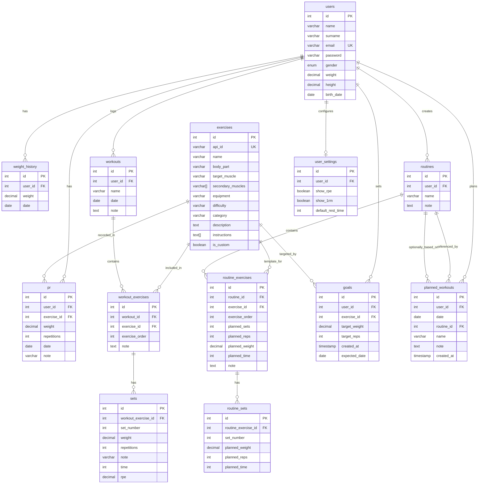

# Database Schema (Mermaid ER Diagram)

```mermaid
erDiagram
    users {
        int id PK
        varchar name
        varchar surname
        varchar email UK
        varchar password
        enum gender
        decimal weight
        decimal height
        date birth_date
    }

    weight_history {
        int id PK
        int user_id FK
        decimal weight
        date date
    }

    exercises {
        int id PK
        varchar api_id UK
        varchar name
        varchar body_part
        varchar target_muscle
        varchar[] secondary_muscles
        varchar equipment
        varchar difficulty
        varchar category
        text description
        text[] instructions
        boolean is_custom
    }

    pr {
        int id PK
        int user_id FK
        int exercise_id FK
        decimal weight
        int repetitions
        date date
        varchar note
    }

    workouts {
        int id PK
        int user_id FK
        varchar name
        date date
        text note
    }

    workout_exercises {
        int id PK
        int workout_id FK
        int exercise_id FK
        int exercise_order
        text note
    }

    sets {
        int id PK
        int workout_exercise_id FK
        int set_number
        decimal weight
        int repetitions
        varchar note
        int time
        decimal rpe
    }

    routines {
        int id PK
        int user_id FK
        varchar name
        text note
    }

    routine_exercises {
        int id PK
        int routine_id FK
        int exercise_id FK
        int exercise_order
        int planned_sets
        int planned_reps
        decimal planned_weight
        int planned_time
        text note
    }

    routine_sets {
        int id PK
        int routine_exercise_id FK
        int set_number
        decimal planned_weight
        int planned_reps
        int planned_time
    }

    goals {
        int id PK
        int user_id FK
        int exercise_id FK
        decimal target_weight
        int target_reps
        timestamp created_at
        date expected_date
    }

    planned_workouts {
        int id PK
        int user_id FK
        date date
        int routine_id FK
        varchar name
        text note
        timestamp created_at
    }

    user_settings {
        int id PK
        int user_id FK
        boolean show_rpe
        boolean show_1rm
        int default_rest_time
    }

    %% Relationships
    users ||--o{ weight_history : "has"
    users ||--o{ pr : "has"
    users ||--o{ workouts : "logs"
    users ||--o{ routines : "creates"
    users ||--o{ goals : "sets"
    users ||--o{ planned_workouts : "plans"
    users ||--o| user_settings : "configures"

    exercises ||--o{ pr : "recorded_in"
    exercises ||--o{ workout_exercises : "included_in"
    exercises ||--o{ routine_exercises : "template_for"
    exercises ||--o{ goals : "targeted_by"

    workouts ||--o{ workout_exercises : "contains"
    workout_exercises ||--o{ sets : "has"

    routines ||--o{ routine_exercises : "contains"
    routine_exercises ||--o{ routine_sets : "has"
    routines ||--o{ planned_workouts : "referenced_by"

    planned_workouts }o--|| routines : "optionally_based_on"
```
